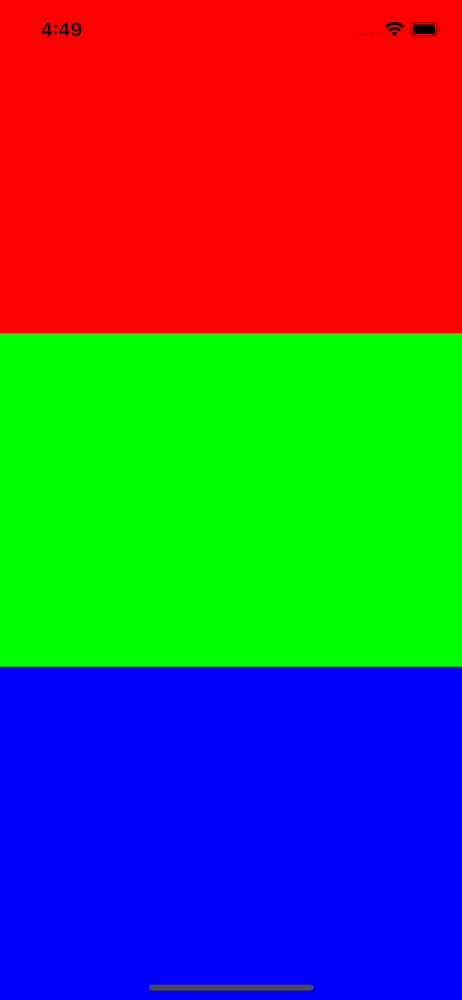

# Color-App

A moblie project I did for learning React Native, and git commands

## About

This project visualizes how colors mix based on their RGB values. I did enjoyed learning about react native and expo through working on this project. 



## Getting Started

Clone this project on your machine to have the code necessary to run this project locally.

1. install npm
```
$ npm install -g npm
```
2. install necessary node packages
```
$ npm install
```
3. start expo project
```
$ npm start
```
4. Follow expo prompts to run on mobile emulator
[IOS emulator set-up](https://doc.arcgis.com/en/appstudio/extend-apps/installdevtoolsemulators.htm#:~:text=Open%20Xcode%20and%20click%20Menu,necessary)

